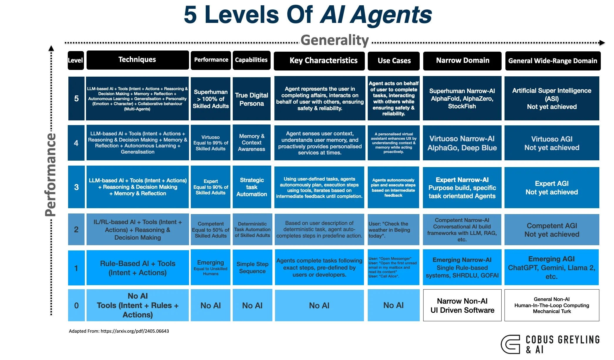

### When The AI Framework Layer Disappears…
# …the Prompt Becomes the Application
#### & The Orchestration Layer Collapses into the Model

> "That's either exciting or terrifying depending on whether you build frameworks for a living."

And most people haven't noticed yet.

---

## Some Observation

When I first used **Anthropic's Agent Teams** I kept waiting for the complexity to show up.

Multi-agent orchestration has always meant frameworks — LangGraph state machines, CrewAI agent definitions, AutoGen conversation patterns…

Hundreds of lines of Python before anything useful happens…or building Agentic Workflows via a node/edge GUI…

**Agent Teams is a prompt.**

You paste natural language into Claude Code, and it spawns teammates, manages tasks, handles messaging, and coordinates work.

- No SDK.
- No YAML.
- No workflow engine.

My first reaction was, this feels too simple. Something must be missing.

**Nothing is missing. The complexity moved. It collapsed into the model.**


---

## What A Multi-Agent Framework Actually Does

I guess every multi-agent framework — CrewAI, LangGraph, AutoGen, Semantic Kernel — handles the same five responsibilities:

```
1. Define agents           | Model (from prompt)
2. Route messages          | Model (native)
3. Manage task lifecycle   | Model (native)
4. Handle dependencies     | Model (native)
5. Spawn/terminate workers | Model (via tooling)
```

And…

```
6. Persistence           | Framework
7. Deterministic replay  | Framework
8. Cost control/limits   | Framework
9. Observability/logging | Framework
10. Error recovery       | Framework
```

**Items 1 to 5 → the model absorbed these.**

**Items 6 to 10 → frameworks still own these.**

When I wrote about the [5 Levels of AI Agents](https://cobusgreyling.medium.com/5-levels-of-ai-agents-updated-0ddf8931a1c6), the highest levels described autonomous multi-agent coordination.



That coordination used to require hundreds of lines of framework code.


Now the model does it natively — you describe the team, and orchestration happens.

This isn't a small shift.

Items 1 through 5 represent roughly **80% of what developers use** a multi-agent framework for.

The remaining 20% — persistence, determinism, cost control, observability, error recovery — is where frameworks still win. But that 20% matters primarily in production. For developer workflows, prototyping, and one-off tasks, it doesn't.

---

## The Collapsing Stack

Look at how the stack has compressed across three eras…


Each generation of models chips away at another layer.

- The framework gets thinner.
- Then it merges with orchestration.
- Then both collapse into the model.
- What remains on top is the application — and the application is a prompt.

---

## The Deeper Implication

**If orchestration collapses into the model, the prompt becomes the application.**

This is exactly what I observed with Agent Teams. The [example prompts](https://github.com/cobusgreyling/claude-agent-teams/tree/main/examples) in the repo aren't documentation. They're the equivalent of `main.py`, written in English. When I wrote the [debugging example](https://cobusgreyling.medium.com/create-custom-agentic-workflows-with-claude-code-ee49805bb28b), it defines five agents, their responsibilities, communication patterns, and output format — all in a single markdown block.

**That markdown block is the application.**

`CLAUDE.md` files aren't config. They're code. The language shifted from Python to English, and the runtime shifted from a framework to the model itself.

As I noted when covering Anthropic's [argument](https://cobusgreyling.medium.com/anthropic-says-coding-agents-are-becoming-the-universal-everything-agent-039f9bb709fc) that coding agents are becoming the universal everything agent, the model isn't just executing instructions — it's absorbing the infrastructure that used to surround it.

---

## What Frameworks Still Own

The remaining 20% is real and it matters — in the right context:

**Persistence.** Agent Teams teammates are ephemeral. They exist for one session. Production agents need state across runs, checkpointing, and replay.

**Determinism.** The same prompt can produce different team structures. Code-defined agents produce the same structure every time. For some pipelines, determinism matters.

**Cost Control.** Frameworks can enforce token budgets, model selection per agent, and circuit breakers. With Agent Teams, each teammate is a full Claude instance and costs scale linearly.

**Observability.** Framework-based agents produce structured logs, traces, and metrics. Agent Teams output is terminal text.

**Error Recovery.** When a framework agent fails, you get retry logic, fallbacks, and compensation patterns. When a teammate fails, the lead decides what to do — which may or may not be what you wanted.

> These are production concerns.

---

## In Closing

Each model generation absorbs another piece of the framework's territory.

- A year ago, defining agent roles required code.
- Six months ago, task routing required code.
- Today, the model handles both natively.

The pattern is consistent…capabilities migrate from application code → framework code → model capability.

The model keeps getting better at orchestration until the framework becomes **optional** for most use cases.

**Not all use cases.** Production systems will need the guardrails that frameworks provide for the foreseeable future.

But for the 80% of multi-agent work that is exploratory, interactive, and disposable, **the framework layer has already disappeared.**

---

*Chief Evangelist @ Kore.ai | Passionate about exploring the intersection of AI and language. Language Models, AI Agents, Agentic Apps, Dev Frameworks & Data-Driven Tools shaping tomorrow. Follow me on [LinkedIn](https://www.linkedin.com/in/cobusgreyling).*
